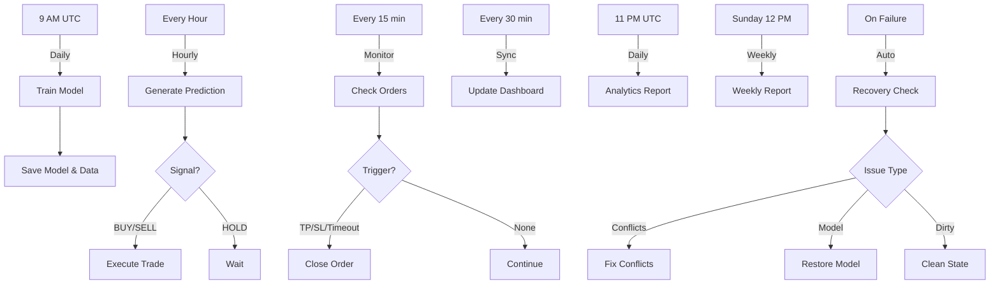

# 🤖 Trading Bot - GitHub Actions Workflows

## 📁 Arquitectura de Workflows

```
.github/workflows/
├── 1-trading-core.yml          # ⚡ Trading principal
├── 2-analytics-reports.yml     # 📊 Analytics y reportes
├── 3-dashboard-sync.yml        # 🌐 Sincronización dashboard
└── 4-auto-recovery.yml         # 🔧 Recuperación automática
```

---

## 1️⃣ Trading Core (`1-trading-core.yml`)

### **Propósito**
Gestiona el ciclo completo de trading automatizado.

### **Triggers**
- **Schedule:**
  - `0 9 * * *` - Entrenamiento diario (9 AM UTC)
  - `0 * * * *` - Trading cada hora
  - `*/15 * * * *` - Monitoreo cada 15 minutos
- **Manual:** Selector de tareas (train/predict/monitor/all)

### **Jobs**

#### `determine-task`
- Decide qué tareas ejecutar según el trigger
- Outputs: `should_train`, `should_predict`, `should_monitor`

#### `train-model`
- Descarga datos históricos ETH-USD
- Entrena modelo LSTM
- Guarda modelo, scalers y gráficas
- Notifica a Telegram

#### `predict-and-trade`
- Genera predicciones
- Aplica filtros técnicos
- Ejecuta órdenes en Kraken
- Registra señales y órdenes

#### `monitor-orders`
- Monitorea órdenes abiertas
- Cierra por TP/SL/Timeout
- Actualiza histórico de trades

### **Secrets Requeridos**
```
TELEGRAM_API
TELEGRAM_CHAT_ID
KRAKEN_API_KEY
KRAKEN_API_SECRET
```

---

## 2️⃣ Analytics & Reports (`2-analytics-reports.yml`)

### **Propósito**
Genera análisis detallados y reportes del rendimiento del trading.

### **Triggers**
- **Schedule:**
  - `0 23 * * *` - Reporte diario (11 PM UTC)
  - `0 12 * * 0` - Reporte semanal (Domingos 12 PM UTC)
- **Manual:** Selector de tipo de reporte

### **Jobs**

#### `generate-analytics`
- Ejecuta `analytics.py`
- Genera gráficas completas
- Calcula métricas avanzadas:
  - Win Rate total y por tipo
  - Profit Factor
  - Curva de equity
  - Distribución de P&L
  - Análisis de señales
- Sube gráficas como artifacts

#### Reportes embebidos
- **Reporte diario:** Resumen del día + stats totales
- **Reporte semanal:** Análisis de 7 días con comparativas

#### `health-check`
- Verifica archivos críticos
- Alerta sobre modelos desactualizados
- Revisa órdenes abiertas antiguas

### **Salidas**
- `trading_analytics.png` (artifact 30 días)
- Notificaciones Telegram con métricas

---

## 3️⃣ Dashboard Sync (`3-dashboard-sync.yml`)

### **Propósito**
Mantiene sincronizado el repositorio del dashboard con datos actualizados.

### **Triggers**
- **Schedule:** `*/30 * * * *` (Cada 30 minutos)
- **Manual:** Con opción de forzar sync

### **Jobs**

#### `sync-to-dashboard`
- Clona repo de trading
- Clona repo de dashboard
- Copia CSVs actualizados:
  - `kraken_trades.csv`
  - `trading_signals.csv`
  - `orders_executed.csv`
  - `open_orders.json`
- Genera `metadata.json` con timestamp
- Commit y push solo si hay cambios

#### `verify-dashboard`
- Solo se ejecuta en sync manual
- Valida integridad de datos
- Verifica formato JSON

### **Configuración**

#### Opción A: Repositorio dedicado
```yaml
secrets:
  DASHBOARD_REPO: "usuario/trading-dashboard"
  DASHBOARD_TOKEN: ${{ secrets.PAT_TOKEN }}
```

#### Opción B: Auto-detectar
Si no defines secrets, usa:
```
<owner>/<current-repo>-dashboard
```

### **Notificaciones**
- Solo notifica cuando hay cambios o ejecución manual
- Reduce spam de Telegram

---

## 4️⃣ Auto Recovery (`4-auto-recovery.yml`)

### **Propósito**
Sistema de auto-recuperación ante fallos.

### **Triggers**
- **Automático:** Cuando `1-trading-core.yml` falla
- **Manual:** Selector de tipo de recuperación

### **Jobs**

#### `check-failure`
- Analiza el estado del repositorio
- Detecta:
  - Conflictos de merge
  - Modelos faltantes/corruptos
  - Working directory sucio
- Decide acción de recuperación

#### `fix-conflicts`
- Reset a estado limpio (`origin/main`)
- Descarta cambios locales conflictivos
- Force push si es necesario

#### `restore-model`
- Busca último commit con modelo válido
- Restaura archivos del modelo
- Si no encuentra, dispara entrenamiento nuevo

#### `clean-state`
- Limpia archivos sin rastrear
- Descarta cambios locales
- Mantiene commits

#### `full-reset`
- ⚠️ **DESTRUCTIVO** - Solo manual
- Backup completo (artifact 30 días)
- Elimina todos los datos
- Crea CSVs vacíos con headers
- Dispara entrenamiento inicial

#### `notify-recovery`
- Notifica resultado de la recuperación

---

## 📊 Flujo Completo del Sistema



---

## 🚀 Guía de Inicio Rápido

### 1. Configurar Secrets en GitHub

Ve a `Settings > Secrets and variables > Actions`:

```
TELEGRAM_API=tu_bot_token
TELEGRAM_CHAT_ID=tu_chat_id
KRAKEN_API_KEY=tu_api_key
KRAKEN_API_SECRET=tu_api_secret
```

**Opcional (para dashboard):**
```
DASHBOARD_REPO=usuario/repo-dashboard
DASHBOARD_TOKEN=github_personal_access_token
```

### 2. Copia los 4 Workflows

Coloca los archivos en `.github/workflows/`:
```bash
.github/workflows/
├── 1-trading-core.yml
├── 2-analytics-reports.yml
├── 3-dashboard-sync.yml
└── 4-auto-recovery.yml
```

### 3. Primera Ejecución

#### Opción A: Manual (Recomendado)
1. Ve a `Actions` en GitHub
2. Selecciona `🤖 Trading Bot Unificado`
3. Click en `Run workflow`
4. Selecciona `task: train`
5. Espera ~15-30 min

#### Opción B: Esperar al schedule
El sistema entrenará automáticamente a las 9 AM UTC del día siguiente.

### 4. Verificar que Funciona

Revisa en Telegram que recibas:
- ✅ Notificación de entrenamiento completado
- 📊 Reporte diario a las 23:00 UTC
- 🚀 Notificaciones de órdenes (cuando haya señales)

---

## 🔧 Troubleshooting

### "Error: No existe ETHUSD_MODELS/"
**Solución:** Ejecuta manualmente el entrenamiento:
```bash
Actions > Trading Bot > Run workflow > task: train
```

### "Merge conflicts detected"
**Solución:** El sistema se recupera automáticamente, pero puedes forzar:
```bash
Actions > Auto Recovery > Run workflow > recovery_type: fix_conflicts
```

### "Dashboard no se actualiza"
**Solución:** Verifica que `DASHBOARD_REPO` exista y tengas permisos:
```bash
Actions > Dashboard Sync > Run workflow > force_sync: true
```

### "Trading no ejecuta órdenes"
**Causas posibles:**
1. Señal es HOLD (normal)
2. Confianza < 60% (filtro de seguridad)
3. Ya hay una orden abierta
4. APIs de Kraken no responden

**Ver logs en:** `Actions > Última ejecución > predict-and-trade`

---

## 📈 Monitoreo y Mantenimiento

### Logs Importantes
- **Trading:** Cada hora en `predict-and-trade` job
- **Errores:** `4-auto-recovery.yml` se activa automáticamente
- **Analytics:** Artifacts guardados 30 días

### Frecuencias de Ejecución
```
Entrenamiento:    1x/día  (9 AM UTC)
Trading:          24x/día (cada hora)
Monitoreo:        96x/día (cada 15 min)
Dashboard:        48x/día (cada 30 min)
Reporte diario:   1x/día  (11 PM UTC)
Reporte semanal:  1x/sem  (Domingo 12 PM UTC)
```

### Consumo de GitHub Actions
Con límite free de 2000 min/mes:
- Trading: ~30 min/día
- Analytics: ~5 min/día
- Dashboard: ~15 min/día
- **Total:** ~50 min/día = **1500 min/mes** ✅

---

## 🎯 Ejecuciones Manuales Útiles

### Entrenar modelo nuevo
```
Workflow: Trading Bot Unificado
Task: train
```

### Generar reporte ahora
```
Workflow: Analytics & Reports
Report type: daily
```

### Forzar sync dashboard
```
Workflow: Dashboard Sync
Force sync: true
```

### Reset completo (⚠️ destructivo)
```
Workflow: Auto Recovery
Recovery type: full_reset
```

---

## 🔐 Seguridad

### Secrets a NUNCA commitear:
- ❌ API keys de Kraken
- ❌ Token de Telegram
- ❌ Tokens de GitHub

### Buenas prácticas:
- ✅ Usa secrets de GitHub
- ✅ Rota las API keys regularmente
- ✅ Limita permisos de GitHub token
- ✅ Revisa logs de trading manualmente

---

## 📞 Soporte

### Si algo falla:
1. Revisa logs en `Actions > [workflow] > [job]`
2. Busca notificaciones de error en Telegram
3. Ejecuta health check manual
4. Si persiste, ejecuta auto-recovery

### Logs útiles:
```bash
# Ver últimos commits
git log --oneline -10

# Ver archivos generados
ls -lh ETHUSD_MODELS/

# Ver datos CSV
head kraken_trades.csv
```

---

## 🎉 Listo!

Tu sistema de trading automatizado está completamente configurado con:
- ✅ Trading 24/7
- ✅ Analytics detallados
- ✅ Dashboard sincronizado
- ✅ Auto-recuperación ante fallos

**Disfruta del trading automatizado! 🚀📈**
